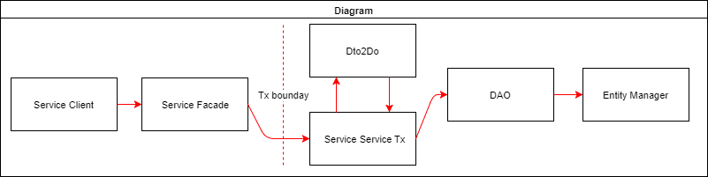
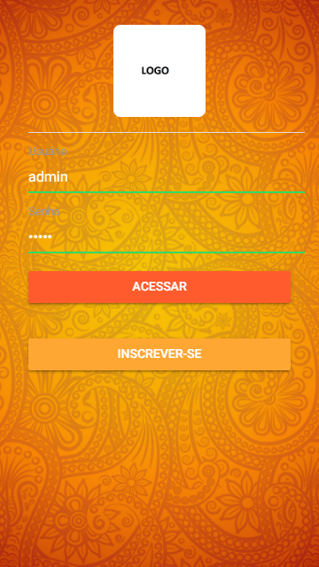
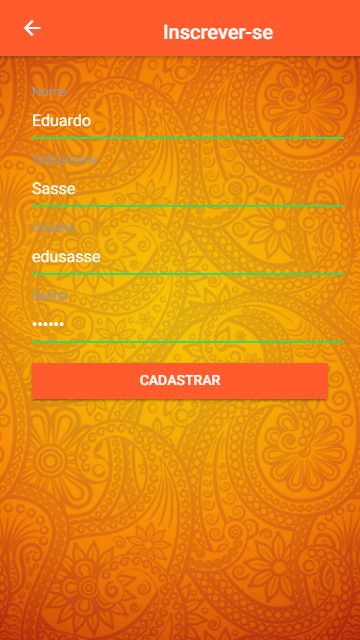
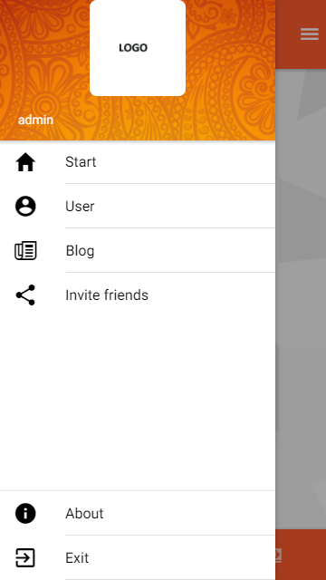

# docker-spring-boot-restful-dozer-ionic-login-jwt

Kickstarter example-application that has its backend based on Spring Boot and uses a Spring Security protected REST backend, athentication with JWT, restful, pagination, rsql, dozer etc. The Ionic 3 app is a side menu app with user registry form.

- Diagram



## Printscreens
 
* Login



* Signup



* Menu



* Start


    
## Stack

* Java 8
* Spring
* Ionic 3
* Dozer
* JWT
* RSQL
* Guava
* Maven
* MySQL

## Details


- Spring Security 

````
@Configuration
@EnableWebSecurity
@EnableGlobalMethodSecurity(prePostEnabled = true)
@Order(SecurityProperties.ACCESS_OVERRIDE_ORDER)
public class SecurityConfig extends WebSecurityConfigurerAdapter {
...

	protected void configure(HttpSecurity http) throws Exception {
		http.csrf().disable().cors().
		and().sessionManagement().sessionCreationPolicy(SessionCreationPolicy.STATELESS).
		and().authorizeRequests()
			.antMatchers("/signup").permitAll()
			.antMatchers("/login").permitAll()
			.antMatchers("/public").permitAll()
			.mvcMatchers("/auth/admin").hasRole("ADMIN")
	        .mvcMatchers("/auth").hasAnyRole("ADMIN","USER")
	        .antMatchers("/*").permitAll()
			.anyRequest().authenticated().
		and().exceptionHandling().accessDeniedHandler(accessDeniedHandler).
		and().apply(new JWTConfigurer(this.tokenProvider));
	}
...
````

- Method Level Authorization

For Java configuration, we need to annotate a @Configuration class with @EnableGlobalMethodSecurity:

````
@RequestMapping(method = RequestMethod.POST)
    @ResponseStatus(HttpStatus.CREATED)
    @ResponseBody
    @PreAuthorize("hasRole('ROLE_ADMIN')")
    public ParametroDTO create(@RequestBody final ParametroDTO resource, final HttpServletResponse response) {
        Preconditions.checkNotNull(resource);
        final ParametroDTO parametro = facade.create(resource);
        final Long idOfCreatedResource = parametro.getId();
        eventPublisher.publishEvent(new ResourceCreatedEvent(this, response, idOfCreatedResource));

        return parametro;
    }
````

- REST Pagination

MVC Controller for pagination:

````
@RequestMapping(params = { "page", "size" }, method = RequestMethod.GET)
    @ResponseBody
    public List<ParametroDTO> findPaginated(@RequestParam("page") final int page, @RequestParam("size") final int size, final UriComponentsBuilder uriBuilder, final HttpServletResponse response) {
        final PageDTO<ParametroDTO> resultPage = facade.findPaginated(page, size);
        if (page > resultPage.getTotalPages()) {
            throw new MyResourceNotFoundException();
        }
        eventPublisher.publishEvent(new PaginatedResultsRetrievedEvent<Parametro>(Parametro.class, uriBuilder, response, page, resultPage.getTotalPages(), size));

        return resultPage.getContent();
    }
````

- Discoverability for REST Pagination

The header includes the link to next and previous pages:

````
link →<http://localhost:8080/auth/parametros?page=0&size=3>; rel="prev", <http://localhost:8080/auth/parametros?page=0&size=3>; rel="first"
````

- REST Query Language with Spring and JPA Criteria

http://localhost:8080/auth/parametros?filter=dsParametro:Test1

n## Build


- building at "./server"
````
mvn clean package docker:build
````

- Running with Docker "./server/src/main/docker"
````
docker-compose up
````

- Running without Docker
````
mvn spring-boot:run
mvn spring-boot:run -Drun.jvmArguments="-Dspring.profiles.active=dev-remote"
````

- Running with debugger
````
mvn spring-boot:run -Drun.jvmArguments="-Dspring.profiles.active=dev-remote -Xdebug -Xrunjdwp:transport=dt_socket,server=y,suspend=y,address=5005"
````

(*) Database documentation and artifacts are available in the "doc" folder;